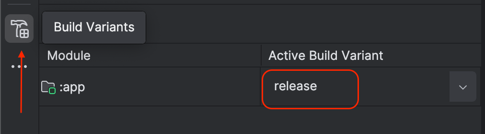
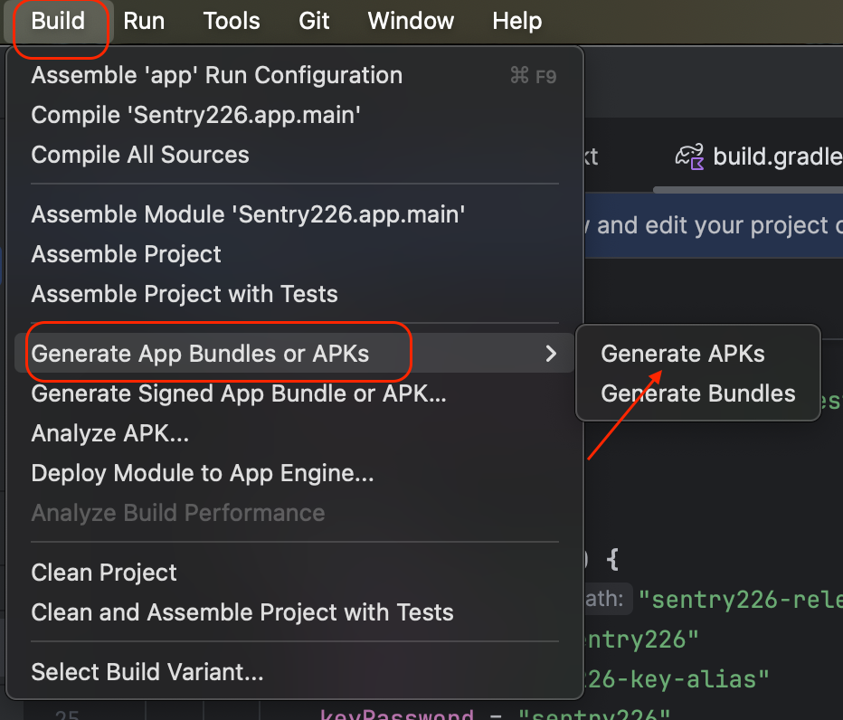
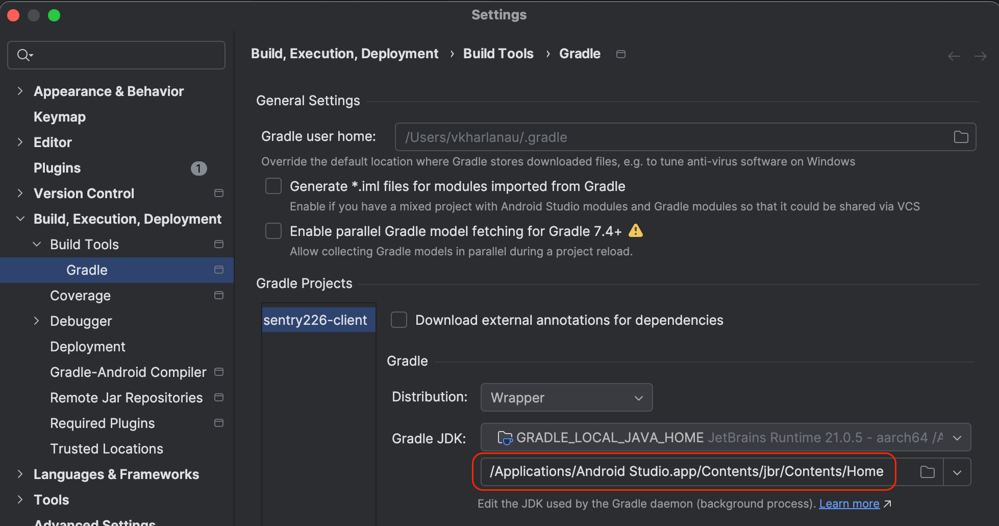
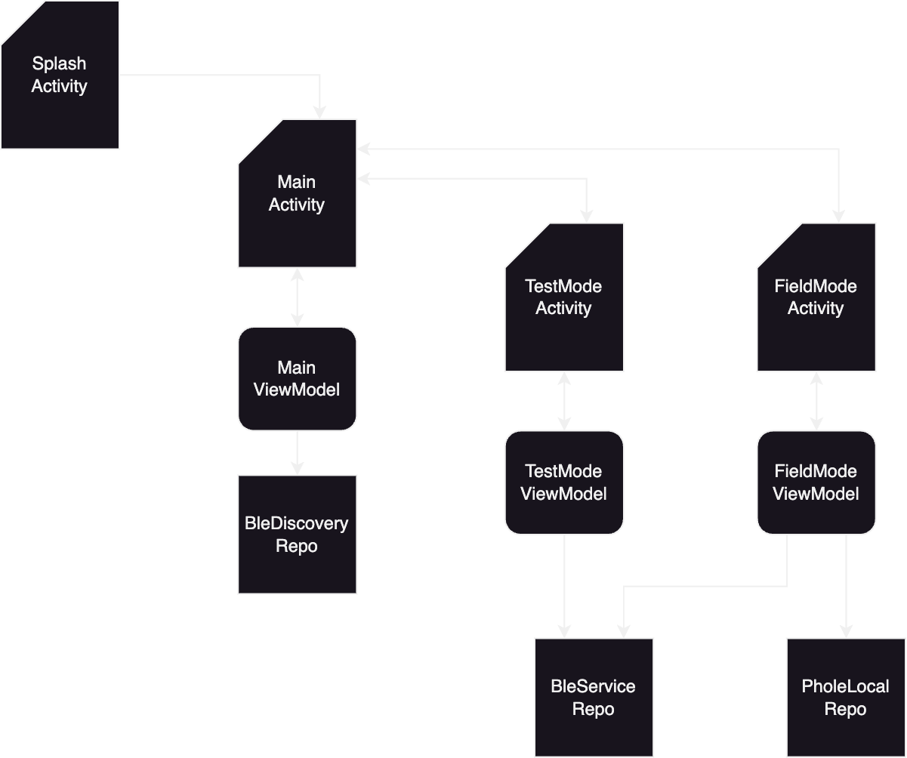

# Sentry226 Android Client

## Prerequisites
This is a regular Android application project created using Android Studio.
In order to compile apk file, can simply install Android Studio and use UI to generate apk file:
- Open Build Variants, then for module called "app" choose "release"


- Go to menu `Build` -> `Generate App Bundles or APKs`  and click `Generate APKs`


Upon successfull compilation the resultank apk will be located here:

./app/build/outputs/apk/release/app-release.apk


Alternatively, you can build project from command line. In order to do that, you need to define JAVA_HOME environment variable and also add java executable location to your PATH variable.
To locate JDK installation that is used by Android studio, can click on `Android Studio` -> `Settings...`

Then expand `Build, Execution, Deployment` -> `Build Tools` -> `Gradle` and see path next to `Gradle JDK`



Open console, set env variables accordingly and execute gradle wrapper build:
```
% export JAVA_HOME=/Applications/Android\ Studio.app/Contents/jbr/Contents/Home
% export PATH=$JAVA_HOME/bin:$PATH
% ./gradlew assembleRelease
```

## Application Design
Application uses Kotlin and implements Model - View - ViewModel (MVVM) pattern. As you can see on diagram below, application has four activities (representing views with navigation between them): Splash Screen, Main Activity, Test Mode and Field Mode. Each activity (besides splash screen) has a correponding ViewModel that contains UI logic (active properties that are bound to corresponding View elements). View model interacts with one or several repositories (aka Models). Repositry represents application business logic of certain domain. In particular:

`BleDiscoveryRepo` - contains logic related to BLE Service discovery

`BleServiceRepo` - includes all fuctions related to communication to discovered BLE Service

`PhoneLocalRepo` - provides logic to handle file store and retrieve gps coordinates

